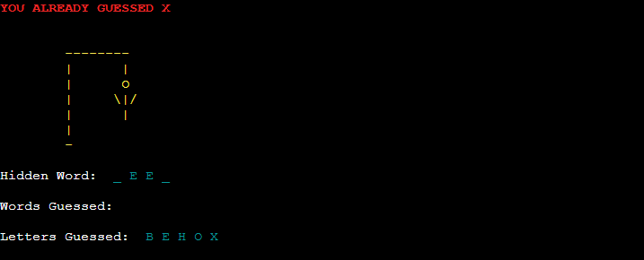

# Hangman with Python

## Table of Contents

- [1. Introduction](#1-introduction)
  * [Overview](#overview)
- [2. User Experience and Design](#2-user-experience-and-design)
  * [User Stories](#user-stories)
  * [Design](#design)
- [3. Features](#3-features)
- [4. Testing](#4-testing)
  * [Use Case Testing](#use-case-testing)
  * [Validator Testing](#validator-testing)
- [5. Bug Fixes](#5-bug-fixes)
- [6. Deployment](#6-deployment)
- [7. Credits](#7-credits)

## 1. Introduction

* ### Overview

  Hangman is a game played by at least 2 people. In this version of Hangman the computer is responsible for providing the player with a word randomly selected from their category of choice. The player has 6 attempts to guess a letter or the complete word. Each failed attempt results in the computer adding another element to the Hangman picture until there are no attempts left and picture is fully drawn by the computer. Rules are available on the welcome screen of the game.

  The live site can be accessed [here](https://ashraaf-hangman.herokuapp.com/)

  

## 2. User Experience and Design

* ### User Stories
  * As a player of the game, I want to know the rules of the game.
  * As a player of the game, I want to enter my name to personalise my game messages.
  * As a player of the game, I want the option to choose a category.
  * As a player of the game, I want to see where the correct letters fit in the hidden word.
  * As a player of the game, I want to see the words I guessed.
  * As a player of the game, I want to see the letters I guessed.
  * As a player of the game, I want to enter the complete word or a single letter.
  * As a player of the game, I do not want to be penalized if I enter a letter that I previously chose.
  * As a player of the game, I do not want to be penalized if I enter a word that I previously chose.
  * As a player of the game, I want to know how many attempts I have left.
  * As a player of the game, I want to know when the game is complete.
  * As a player of the game, I want to be able to continue or quit when the game is complete.

* ### Design
  * Game Workflow
    * The game workflow was designed using [Lucid Charts](https://www.lucidchart.com/).  

      

  * Google Sheets
    * The game categories are stored in a google sheets workbook. Each category is stored in a separate worksheet and accessed via the Google API

      
 
  * Text to ASCII
    * ASCII art was defined for the welcome screen and the player won screen. The tool used to generate the ASCII art can be found [here](http://patorjk.com/)
    
      

  * Text Colors & Formatting
    * Colors were defined as constants and labelled for their purpose

      * ERROR = Red
      * MESSAGE = Blue
      * INPUT = Green
      * ASCII = Yellow
      * OUTPUT = Cyan

    * Formatting was also included in the Colors constants

      * RESET = resets the colors and format to default
      * UNDERLINE = underlines the text
      * BOLD = font weight is increased
    
      

## 3. Features
This section introduces the features that have been implemented to satisfy user stories that have been defined.

* Welcome Screen
  * The game name is displayed using the text to ASCII generator and a yellow color to make it stand out.
  * Rules are displayed to provide the player with the basic information required to play the game.
  * The option to continue is displayed in green and when the user hits Enter on the keyboard they can continue.

    

* Enter Username
  * The game requires the user to enter a username in order to personalize the messages being displayed.
    *  The username must consist of alpha characters only. ValueError is raised if the player enters letters or symbols.

       

    *  The username must not exceed 10 alpha characters. ValueError is raised if the player enters more than 10 alpha characters.

        

* Display Categories
  * Upon successful validation of the username, the player is presented with a personalised message with text to confirm the next steps required by the player.

    

  * The player is provided with the number to enter once they have decided on their word category of choice.

    

  * If the player enters any option other than the numbers available, they are presented with an error message in red text.

    

* Main Game Screen
  * The player is presented with a personalized message.

    

  * The initial state of the hangman image is displayed to the player along with the placeholders for hidden word, words guessed and letters guessed.
    
    

  * The player is prompted to enter a letter or complete word.
    
    

  * If the player enters any value other than a single letter or word that matches the length of hidden word, they are presented with ValueError message in red text.

    

  * If the player enters a letter not in the hidden word, the following is executed:
    * The message at the top of the terminal is updated with confirmation that available attempts have decreased.
    * The hangman image is updated.
    * The letter guessed is added to the Letters Guessed placeholder.
    
      

  * If the player enters a letter that is in the hidden word, the following is executed:
    * The message at the top of the terminal is updated with confirmation and a reminder of the number of attempts used so far.
    * The hangman image is not updated as it was a correct letter.
    * The hidden word reveals the location of the letter in the word.
    * The letter guessed is added to the Letters Guessed placeholder.
    
      

    * If the player enters a letter that was already guessed, the following is executed:
      * The player is presented with an error message in red text.
      * The attempts value and hangman picture is not updated as the player is not penalized.
    
      

    * If the player enters a word that is not the hidden word, the following is executed:
    * The message at the top of the terminal is updated with confirmation that available attempts has decreased.
    * The hangman image is updated.
    * The word guessed is added to the Words Guessed placeholder.
    
      

    * If the player enters a word that was already guessed, the following is executed:
      * The player is presented with an error message in red text.
      * The attempts value and hangman picture is not updated as the player is not penalized.
    
      
 
* Game Won Screen
   * If the player enters a word that is the hidden word. The game won screen is displayed and user is presented with the option to play again or return to main screen.
    
       

* Game Lost Screen
   * If the player depletes their available attempts with letters or words used. The game lost screen is displayed and user is presented with the option to play again or return to main screen.
    
       

## 4. Testing

* ### Use Case Testing

  * As a player of the game, I want to know the rules of the game.

    * Player can view the rules of the game on welcome screen.

  * As a player of the game, I want to enter my name to personalise my game messages.

    * Player can enter a username that complies with the game's requirements.

  * As a player of the game, I want the option to choose a category.

    * Player can make a selection that is available in the game category options.

  * As a player of the game, I want to see where the correct letters fit in the hidden word.

    * Player can see the hidden word which is represented by "_" for each letter of the word.

  * As player of the game, I want to see the words I guessed.

    * Player can see the words already guessed.

  * As player of the game, I want to see the letters I guessed.

    * Player can see the letters already guessed.

  * As a player of the game, I want to enter the complete word as well as a letter.

    * Player can enter the completed word or just a single letter.

  * As a player of the game, I do not want to be penalized if I enter a letter or word that I previously chose.

    * Player is not penalized for entering the same letters or words more than once.

  *  As a player of the game, I want to know how many attempts I have left. 

    * Player is presented with a message showing available attempts after entering a validated word or letter not previously used.

  *  As a player of the game, I want to know when the game is complete.

    * Player is presented with a Game Won or Game Lost message when game is completed.

  * As a player of the game, I want to be able to continue or quit when the game is complete.

    * Player is presented with an option to continue or quite on the Game Won or Game Lost message.

* ### Validator Testing
  * Python
    * No errors were found when passing through the [PEP8 Online validator](http://pep8online.com//)

  * Mobile Responsiveness
     * Application was not developed for mobile
     
  * Desktop Browser Compatibility
     * Site was tested in the following browser:
      * Chrome Version 96.0.4664.110 (Official Build) (64-bit)

## 5. Bug Fixes

| Bug | Solution |
| --------------- | --------------- |
| 1. ValueError message not triggered when the word guessed is longer than the hidden word | The operator in play_hangman function negated the ValueError. Changed from ">" to "<" |
| 2. Words already guessed increases the player attempts | removed the increment of attemps in c play_hangman code block where correct word is validated  |
| 3. When entering lowercase letters they do not match a capitalized word | Changed all player input to uppercase using uppper() and updated get_random_word function to generate word in uppercase |
| 4. ValueError raised when username matches the assumed code condition | Fixed indentation with else: statement in get_user function  |
| 5. Category options not working after moving Google access information to a separate file | Updated variable references and updated api.py to import "Credentials" and "gspread" |
| 6. Letters and words guessed are displayed when player continues a new game | Added clear() function in play_hangman code block where game_lost and game_won functions are executed |

## 6. Deployment

The site was deployed to Heroku. The steps to deploy are as follows: 
  * Create an account [Heroku](https://dashboard.heroku.com/apps) or sign in if you already have an account.
  * Click **New** and select **Create new app**.
  * Enter a unique name for your App and click **Create app**.
  * Click the **Settings** tab and select **Add buildPack** 
  * Select **python** and click **Save Changes**.
  * Click **Add buildPack** again and select **nodejs** then click **Save Changes**.
    * *PS: Python should be listed first. You can drag and drop to change the order.*
  * In the **Settings** tab click **Reveal Config Vars** and input the following:
     * KEY = PORT and  VALUE = 8000
     * *If you have sensitive information that is not deployed to your repository then add the additional Config Vars*
     * KEY = your reference (uppercase) and VALUE = details of your sensitive data
  * Click the **Deploy** tab and select your **Deployment method**. 
  
  *The next steps apply if you are using GitHub as your repository. If not using GitHub, follow the Heroku on screen instructions.*
  * Click **Connect** for the repository you want to deploy to Heroku.
  * You can choose **Enable Automatic Deploys** or **Manual Deploy**. 
  * If you selected **Manual Deploy** click **Deploy Branch**
  * Once deployment is complete you will see a **View** button that will launch your deployed Heroku App.

## 7. Credits

The following section identifies websites and individuals that supported me whilst building the game site.
 
  * [Code Institute Course Material](https://learn.codeinstitute.net/)
  * Reuben Ferrante - Senior Python Developer for his mentorship regarding best industry practices
  * [Lucidchart for Flowcharts](https://www.lucidchart.com/)
  * [Python - w3schools](https://www.w3schools.com/python/)
  * [General Python Solutions](https://stackoverflow.com/)
  * [Hangman Categories](https://www.chegg.com/homework-help/questions-and-answers/c-code-heres-floechart-list-words-caregories-posible-store-words-arrays-heres-flow-chart-n-q63270475)
  * [Hangman Hard Word List ](https://futureofworking.com/40-hardest-words-to-guess-in-hangman/)
  * [Terminal Text Colors](https://www.geeksforgeeks.org/print-colors-python-terminal/)
  * [Python Enumerate Function](https://www.geeksforgeeks.org/enumerate-in-python/)
  * [Clear Console Solution](https://www.delftstack.com/howto/python/python-clear-console/)
  * [Creating List from Nested List](https://blog.finxter.com/python-list-of-lists/#Create_a_List_of_Lists_in_Python)
  * [Lucidchart for Flowcharts](https://www.lucidchart.com/)
  * [Flake8 Rules](https://www.lucidchart.com/)

